```mermaid {theme: 'neutral', scale: 0.8}
graph LR
launch -.->|Symbolic Link| C[📄 index.html]
```

# L'arborescence de fichier et les permissions
### Dossiers, fichiers, liens symboliques et exécutables

```mermaid {theme: 'neutral', scale: 0.8}
graph LR
B[📁 src] --> C[📄 index.html]
B[📁 src] --> D[🚀 execute.sh]
B[📁 src] --> E[🚀 execute_me]
```

Sur les systèmes Unix, l'extension n'est pas obligatoire.

 

Sur les systèmes Unix, on utilise la notion de lien symbolique (= raccourci)

---
transition: fade-out
hideInToc: true
---
# L'arborescence de fichier et les permissions
### Les droits et permissions

TODO: est-ce que c'est pas gênant du coup de pas connaître l'user Root ?

TODO : Ajouter tableau et explication des niveaux de droits