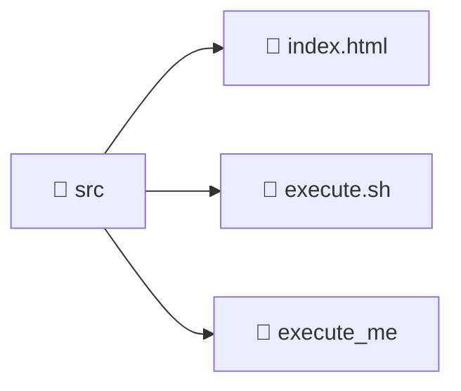
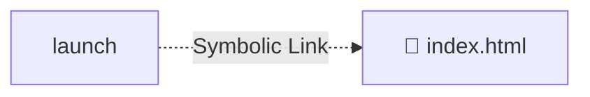

# L'arborescence de fichier et les permissions
### Dossiers, fichiers, liens symboliques et exécutables

Sur les systèmes Unix, l'extension n'est pas obligatoire.

 

Sur les systèmes Unix, on utilise la notion de lien symbolique (= raccourci)

---
transition: fade-out
hideInToc: true
---
# L'arborescence de fichier et les permissions
### Les droits et permissions

d

rwx

r-x

r-x

Type

Permission_propriétaire

Permission_groupe

Permission_publique

 

Exemple : 
- rwx r-- r--

⚠️ ⚠️     &nbsp; &nbsp;Attention, modifier les permissions de certains fichiers peut casser certains programmes (ex: clé ssh)

[Documentation officielle](https://doc.ubuntu-fr.org/permissions#explication_par_l_exemple)

<!--
d : type de ressource (dossier, fichier, lien symbolique, socket, etc.)
triplet : permission du propriétaire
triplet : permission du groupe
triplet : permission générale
-->